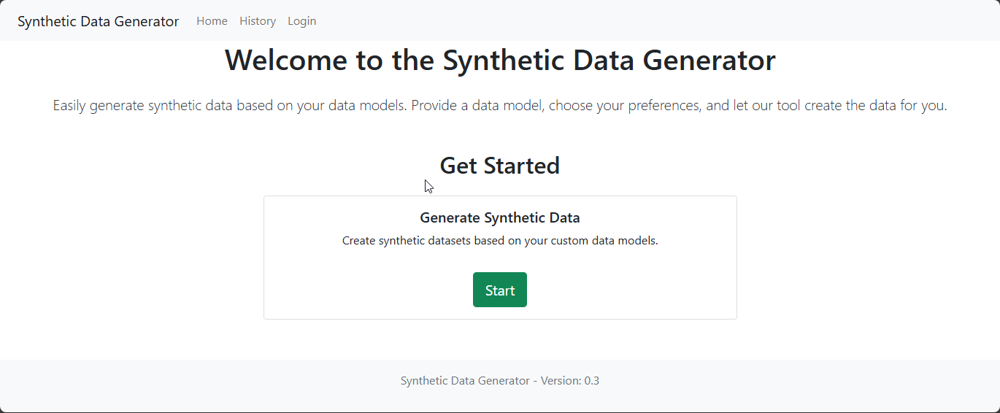
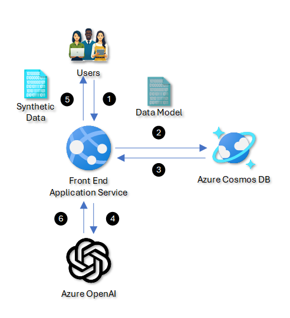

# Synthetic Data Generator

The Synthetic Data Generator is designed to facilitate the creation of synthetic datasets tailored to specific data models. The application requests users to define data models, customize generation parameters, and produce synthetic datasets in multiple output formats, integrating with Azure services. Built on Flask and powered by Azure OpenAI’s GPT models, it offers an efficient solution for developers, data scientists, and analysts to simulate and analyze data behavior.



### Architecture



## Application Use Flow

The Synthetic Data Generator application leverages a combination of user inputs, Azure Cosmos DB, and Azure OpenAI to generate synthetic data based on specified data models. Here is a detailed step-by-step flow of the application:

1. **User Interaction with the Front End:**
   - **Data Model Submission:** Users start by submitting a data model through the web interface. This can be done by manually entering a data model or by uploading a `.sql`, `.csv`, or `.txt` file.
2. **Data Storage:**
   - **Storing Data Models:** Once the data model is submitted, it is stored in Azure Cosmos DB. This ensures that all data models are securely saved and can be managed or reused for future synthetic data generation.
3. **Retrieving Data Models:**
   - **Data Access:** The front end application service retrieves the data models from Azure Cosmos DB when needed. This could be for data generation or when a user wishes to view or modify a previously submitted model.
4. **Synthetic Data Generation:**
   - **Interaction with Azure OpenAI:** The application sends the retrieved data model to Azure OpenAI. Utilizing advanced AI algorithms, Azure OpenAI processes the data model to generate synthetic data that adheres to the structures and constraints defined within the model.
5. **Delivering Synthetic Data:**
   - **Data Delivery to Users:** The generated synthetic data is then sent back to the front end application service, where it is displayed to the user. Users can review the synthetic data, and if it meets their requirements, they can proceed to download it.
6. **Downloading Data:**
   - **Data Download:** Users have the option to download the synthetic data in various formats such as CSV or SQL, which can then be used for testing, machine learning, or other analytical purposes.

## Features

- **Provide Data Model**: Input your data model directly through the web interface or upload a `.sql`, `.csv`, or `.txt` file.
- **Customizable Options**: Specify the number of rows, preview options, and output format (CSV, SQL, etc.).
- **Data Preview**: View a preview of the generated data before downloading.
- **Download Generated Data**: Download the full synthetic dataset in your chosen format.
- **History Management**: Access and manage your previous data generation results.
- **Secure Authentication**: User authentication via Azure Active Directory.
- **Data Storage**: Securely stores data models and generated datasets using Azure Cosmos DB.

## Prerequisites

- **Python 3.7 or higher**
- **Azure Account**: Access to Azure services like Azure OpenAI, Azure Cosmos DB, and Azure AD for authentication.
- **OpenAI API Key**: An API key for Azure OpenAI.
- **Azure Cosmos DB Credentials**: Endpoint and primary key for your Cosmos DB instance.
- **Flask and Dependencies**: See `requirements.txt` for a full list of Python dependencies.

## Installation

1. **Clone the Repository**

   ```bash
   git clone https://github.com/yourusername/synthetic-data-generator.git
   cd synthetic-data-generator
   ```

2. **Create a Virtual Environment**

   ```bash
   python -m venv venv
   source venv/bin/activate  # On Windows use `venv\Scripts\activate`
   ```

3. **Install Dependencies**

   ```bash
   pip install -r requirements.txt
   ```

## Configuration

1. **Environment Variables**

   Create a `.env` file in the root directory of your project and populate it with the following variables:

   ```ini
   FLASK_KEY="<YOUR_FLASK_SECRET_KEY>"

   AZURE_OPENAI_API_TYPE="azure"
   AZURE_OPENAI_KEY="<YOUR_AZURE_OPENAI_KEY>"
   AZURE_OPENAI_ENDPOINT="<YOUR_AZURE_OPENAI_ENDPOINT>"
   AZURE_OPENAI_API_VERSION="<YOUR_AZURE_OPENAI_API_VERSION>"
   AZURE_OPENAI_MODEL="<YOUR_AZURE_OPENAI_MODEL_NAME>"

   AZURE_COSMOS_ENDPOINT="<YOUR_AZURE_COSMOS_DB_ENDPOINT>"
   AZURE_COSMOS_KEY="<YOUR_AZURE_COSMOS_DB_KEY>"
   AZURE_COSMOS_DB_NAME="SyntheticData"
   AZURE_COSMOS_FILES_CONTAINER_NAME="files"
   AZURE_COSMOS_DATA_CONTAINER_NAME="data"

   CLIENT_ID="<YOUR_AZURE_AD_CLIENT_ID>"
   TENANT_ID="<YOUR_AZURE_AD_TENANT_ID>"
   MICROSOFT_PROVIDER_AUTHENTICATION_SECRET="<YOUR_AZURE_AD_CLIENT_SECRET>"
   ```

   Replace all placeholders with your actual credentials.

2. **Azure Services Setup**

   - **Azure OpenAI**: Ensure you have access to Azure OpenAI services and have your API key and endpoint.
   - **Azure Cosmos DB**: Set up a Cosmos DB instance and create the required databases and containers.
   - **Azure Active Directory**: Register your application and obtain the client ID, tenant ID, and client secret.

## Running the Application

1. **Activate the Virtual Environment**

   ```bash
   source venv/bin/activate  # On Windows use `venv\Scripts\activate`
   ```

2. **Set Flask Environment Variables**

   ```bash
   export FLASK_APP=app.py
   export FLASK_ENV=development  # Optional: Enables debug mode
   ```

3. **Run the Flask Application**

   ```bash
   flask run
   ```

   The application will be available at `http://localhost:5000`.

## Usage

1. **Home Page**

   - Click on **Start** to begin generating synthetic data.

2. **Choose Data Model Input Method**

   - **Provide Data Model Text**: Manually input your data model.
   - **Upload Data Model File**: Upload a `.sql`, `.csv`, or `.txt` file containing your data model.
   - **Select from Saved Models**: Choose a previously uploaded data model.

3. **Set Generation Options**

   - Specify the **Number of Rows** you want to generate.
   - Choose whether to **Preview Data** before downloading.
   - Select the **Output Format** (e.g., CSV, SQL).

4. **Generate Data**

   - Click on **Generate Data**.
   - The application will process your request and display a preview if selected.

5. **Download Data**

   - Click on **Download Data** to download the full synthetic dataset.

6. **View History**

   - Access the **History** page to view and manage your past data generation results.

## Screenshots

*Note: Include screenshots of your application to illustrate the steps mentioned above.*

## Technologies Used

- **Flask**: Web framework for Python.
- **OpenAI GPT Models**: For generating synthetic data based on prompts.
- **Azure OpenAI**: Integration with Azure's OpenAI services.
- **Azure Cosmos DB**: For storing data models and generated datasets.
- **Azure Active Directory**: Secure user authentication.
- **Bootstrap**: Front-end styling and responsive design.
- **HTML/CSS/JavaScript**: Web interface development.

## Contributing

Contributions are welcome! Please follow these steps:

1. **Fork the Repository**

2. **Create a Feature Branch**

   ```bash
   git checkout -b feature/YourFeature
   ```

3. **Commit Your Changes**

   ```bash
   git commit -m "Add your message here"
   ```

4. **Push to Your Branch**

   ```bash
   git push origin feature/YourFeature
   ```

5. **Create a Pull Request**

## License

This project is licensed under the [MIT License](LICENSE).

## Contact

- **Project Maintainer**: [Your Name](mailto:your.email@example.com)
- **GitHub**: [https://github.com/yourusername/synthetic-data-generator](https://github.com/yourusername/synthetic-data-generator)

---

Feel free to customize this README to better fit your project's specifics, such as adding screenshots, updating contact information, or providing more detailed instructions.